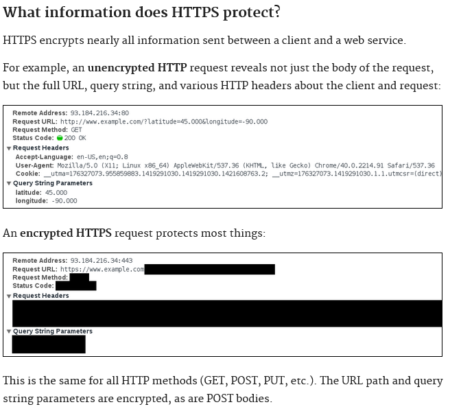

# Proxy https server for legacy http server

## What https does
[https://https.cio.gov/faq/](https://https.cio.gov/faq/)

## Generating key

$ openssl genrsa 1024 > private.pem  
$ openssl req -x509 -new -key -private.pem > public.pem